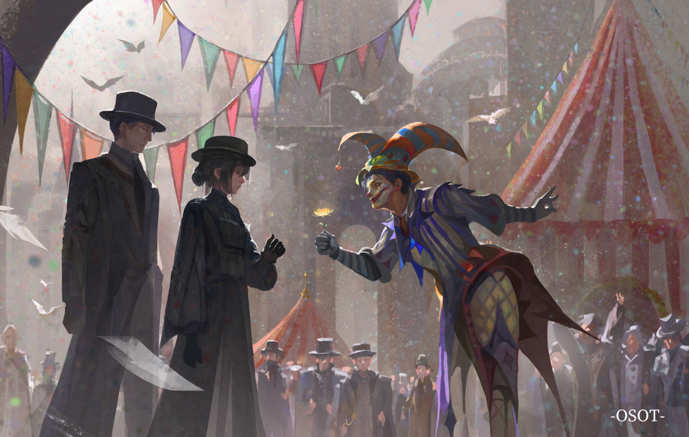

## Welcome ～(˵¯͒〰¯͒˵)～ ★

<!--

-->

<b>This is Frankel Zhao.  </b> 
[Click to View My Website!](https://furkathertaha.github.io/)  
 
<b> I see, therefore I think.   I think, therefore I am.   I am, therefore I see.  &emsp;&emsp;&emsp;&emsp; ------------------   </b>
 
<b> Perception is all by which one's existence can be verified. Learn to appreciate wonderful things in the world! Lives are more fulfilled when starting to interact with surroundings, whether physically or digitally. Love others, love family, embrace what you like, and chase for what you want. </b>  
  
<b> So, you can call me Furkathertaha, a weird name that arose in my head when I was young. No worry about its meaning, it's childhood innocence after all. I like fantasy, digital creations, games, anime, and virtual representations. I am currently focused on physics-based simulation (PBS), computer graphics (CG), and machine learning (ML) applications. I would share some of my work at GitHub and hope to make continuous improvements. Hum, on the right is <!--
[Hu Tao](https://www.google.com/search?q=Hu+Tao&sca_esv=7994f51f647571a9&sca_upv=1&sxsrf=ACQVn08wO7zCDsgyY4qRaKmr8Wxlw-k4WA%3A1711229186420&ei=Akn_ZZajGYTBvr0PgoWKwAc&ved=0ahUKEwiWrKS-qYuFAxWEoK8BHYKCAngQ4dUDCBA&uact=5&oq=Hu+Tao&gs_lp=Egxnd3Mtd2l6LXNlcnAiBkh1IFRhbzIKEAAYRxjWBBiwAzIKEAAYRxjWBBiwAzIKEAAYRxjWBBiwAzIKEAAYRxjWBBiwAzIKEAAYRxjWBBiwAzIKEAAYRxjWBBiwAzIKEAAYRxjWBBiwAzIKEAAYRxjWBBiwAzIKEAAYRxjWBBiwAzIKEAAYRxjWBBiwA0iVB1AAWABwAXgBkAEAmAEAoAEAqgEAuAEDyAEAmAIBoAIDmAMAiAYBkAYKkgcBMaAHAA&sclient=gws-wiz-serp), one of my favorite characters. Here is a doppelganger, of course. 
--> [Klein and Melissa](https://www.bilibili.com/video/BV17G411m7MZ/?spm_id_from=333.337.search-card.all.click&vd_source=c5491107713fb9e34e48ab93f260f495), one of my favorite scenes from [Lord of Mysterious](https://www.google.com/search?q=lord+of+mysterious&sca_esv=23c07de5ac49e31f&sca_upv=1&sxsrf=ACQVn08uFj2us52y9G4wMGebsRP_kz7YdQ%3A1711890759196&ei=R2EJZoHHC6G8vr0PrsmMuA0&ved=0ahUKEwjBhuKEyp6FAxUhnq8BHa4kA9cQ4dUDCBA&uact=5&oq=lord+of+mysterious&gs_lp=Egxnd3Mtd2l6LXNlcnAiEmxvcmQgb2YgbXlzdGVyaW91czIKEAAYRxjWBBiwAzIKEAAYRxjWBBiwAzIKEAAYRxjWBBiwAzIKEAAYRxjWBBiwAzIKEAAYRxjWBBiwAzIKEAAYRxjWBBiwAzIKEAAYRxjWBBiwAzIKEAAYRxjWBBiwA0iECVAAWABwAngBkAEAmAEAoAEAqgEAuAEDyAEAmAICoAIEmAMAiAYBkAYIkgcBMqAHAA&sclient=gws-wiz-serp#ip=1).
As you can see, the virtual world indeed has metaphysical glamour, where you can easily transcend realistic constraints and meet with lovely things. Nevertheless, fantastic creation can't leave real-world techniques, like personal welfare never leave dedicated work. Life is potential, and the choice is in our hands.
 
 
<b> More is coming! >~< </b> 
 
 

<b>Webpage Design:</b>

 <b>Webpage Design:</b> 

    

<!-- see my workflow-->
<picture>
  <source media="(prefers-color-scheme: dark)" srcset="https://raw.githubusercontent.com/Furkathertaha/Furkathertaha/output/github-contribution-grid-snake-dark.svg">
  <source media="(prefers-color-scheme: light)" srcset="https://raw.githubusercontent.com/Furkathertaha/Furkathertaha/output/github-contribution-grid-snake.svg">
  
</picture>

  

